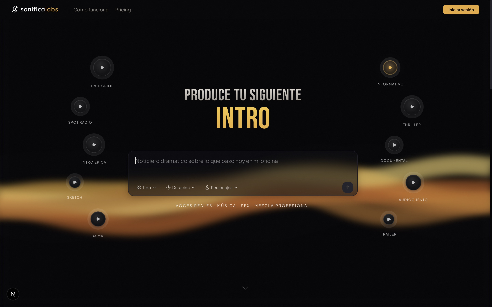
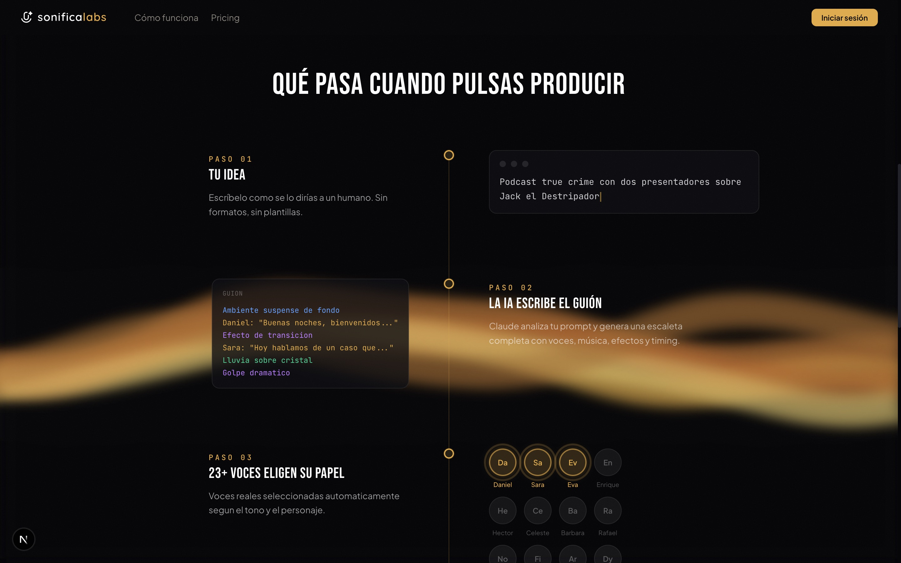
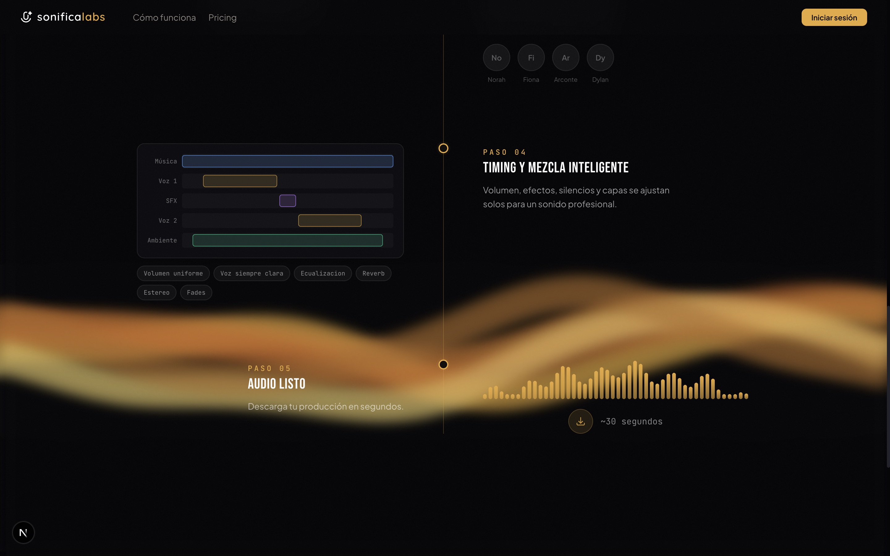
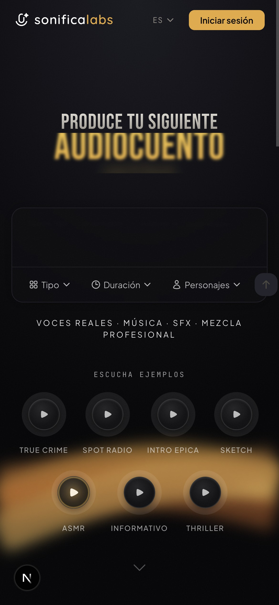

<div align="center">


# sonificalabs

### AI-Powered Audio Production Studio

**Type a prompt. Get a fully produced audio piece — with real voices, music, SFX, and professional mixing.**

No templates. No timelines. No audio skills needed.

---



</div>

## What is this?

SonificaLabs turns a single sentence into broadcast-ready audio. Describe what you want in natural language — a true crime podcast intro, a radio spot for your pizzeria, an ASMR meditation — and the AI produces it end-to-end in ~30 seconds.

Behind the scenes: **Claude** writes a structured audio script (escaleta), **ElevenLabs** synthesizes 23+ realistic voices, and **FFmpeg** mixes everything with professional-grade processing — volume normalization, EQ, reverb, stereo panning, crossfades.

You just write. The AI produces.

## See it in action

<table>
<tr>
<td width="50%">

### The Pipeline

Every production follows 5 automated steps — from your idea to a downloadable MP3.

1. **Your idea** — Write it like you'd tell a human
2. **AI writes the script** — Claude generates a full escaleta with voices, music, SFX, and timing
3. **23+ voices choose their role** — Automatically cast based on tone and character
4. **Intelligent mixing** — Volume, EQ, reverb, stereo, fades — all automated
5. **Audio ready** — Download in ~30 seconds

</td>
<td width="50%">



</td>
</tr>
</table>

<table>
<tr>
<td width="50%">



</td>
<td width="50%">

### Professional Mixing Engine

The AI doesn't just stitch clips together. Every production goes through a full mixing pipeline:

- **Volume normalization** — Consistent loudness across all tracks
- **Voice clarity** — Voices always sit above the mix
- **EQ & compression** — Broadcast-standard processing
- **Reverb & stereo** — Spatial depth and dimension
- **Crossfades** — Smooth transitions between segments

</td>
</tr>
</table>

<div align="center">

### Fully Responsive

Works beautifully on any device.



</div>

## Demo Categories

Listen to AI-produced samples across 10 genres:

| | Genre | Description |
|---|---|---|
| 🎙 | **True Crime** | Dark, atmospheric podcast intros |
| 📢 | **Radio Spot** | Commercial ads with punch |
| 🎬 | **Epic Intro** | Cinematic openers |
| 😂 | **Comedy Sketch** | Multi-character humor |
| 🧘 | **ASMR / Meditation** | Calm, whispered relaxation |
| 📰 | **News** | Professional broadcast style |
| 🔪 | **Thriller** | Suspenseful narratives |
| 🌍 | **Documentary** | Educational storytelling |
| 📖 | **Audio Story** | Narrated fiction with atmosphere |
| 🎥 | **Trailer** | Movie-style dramatic teasers |

## Tech Stack

| Layer | Tech |
|---|---|
| **Framework** | [Next.js 16](https://nextjs.org/) + React 19 |
| **Styling** | [Tailwind CSS 4](https://tailwindcss.com/) |
| **Animations** | [Framer Motion](https://motion.dev/) |
| **Auth** | [NextAuth v5](https://authjs.dev/) (Google OAuth) |
| **i18n** | [next-intl](https://next-intl.dev/) (Spanish / English) |
| **Audio** | [WaveSurfer.js](https://wavesurfer.xyz/) for waveform visualization |
| **Deployment** | Docker-ready |

## Getting Started

```bash
# Install dependencies
npm install

# Set up environment variables
cp .env.example .env.local
# Fill in AUTH_SECRET, AUTH_GOOGLE_ID, AUTH_GOOGLE_SECRET, NEXT_PUBLIC_API_URL

# Run development server
npm run dev
```

Open [http://localhost:3000](http://localhost:3000).

## Environment Variables

| Variable | Description |
|---|---|
| `NEXT_PUBLIC_API_URL` | Backend API URL |
| `AUTH_SECRET` | NextAuth secret key |
| `AUTH_GOOGLE_ID` | Google OAuth client ID |
| `AUTH_GOOGLE_SECRET` | Google OAuth client secret |
| `INTERNAL_SECRET` | Shared secret for backend auth sync |

## Project Structure

```
sonificalabs-web/
├── app/[locale]/          # Pages (i18n routing)
│   ├── page.tsx           # Landing — hero, demos, pipeline
│   ├── p/[id]/page.tsx    # Production viewer + SSE streaming
│   ├── pricing/page.tsx   # Plans & Stripe checkout
│   ├── account/page.tsx   # User account management
│   ├── admin/page.tsx     # Admin dashboard
│   └── signin/page.tsx    # Auth page
├── components/
│   ├── PromptForm.tsx     # Main input with type/duration/character selectors
│   ├── PipelineReveal.tsx # Animated "how it works" section
│   ├── Studio.tsx         # Post-production DAW-like editor
│   ├── AudioPlayer.tsx    # Waveform audio player
│   ├── studio/            # Timeline editor components
│   └── ui/                # Animated UI primitives
├── i18n/                  # Internationalization config
├── lib/
│   ├── api.ts             # API client (apiFetch)
│   ├── auth.ts            # NextAuth configuration
│   ├── voices.ts          # Voice catalog for UI
│   └── types.ts           # Shared types
├── messages/              # Translation files (en.json, es.json)
└── public/
    ├── demos/             # Sample audio files (en/ & es/)
    ├── fonts/             # Custom typography
    └── screenshots/       # App screenshots
```

## Related

- **[sonificalabs-api](https://github.com/ralungei/sonificalabs-api)** — Backend API (Hono, Claude, ElevenLabs, FFmpeg)

---

<div align="center">

**[sonificalabs.com](https://sonificalabs.com)**

Built with Claude, ElevenLabs & FFmpeg.

</div>
